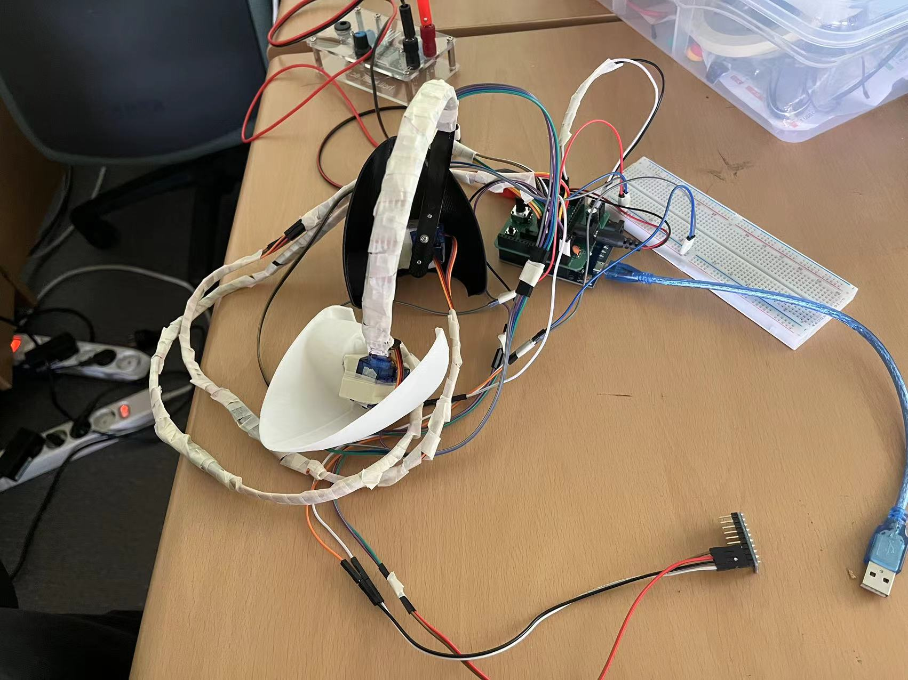

# EarCon based on the arduino

---

## Description

1.Control the ear to move from the back to front and front to back by potentiometer.
2.Control the ear to move from the left to right and right ot left by tilting the IMU sensor
3.Change the mode of LED strip

---

## Preparation

- Arduino board
- PCB board(see in the file)
  - potentiometer
  - slider switch
- Some Jumpers
- Four servo motors
- IMU sensor
- LED strip

---

### View

---

# 基于 arduino 的 EarCon

---

## 描述

1.通过电位器控制耳朵从后向前和从前向后移动。 2.通过倾斜 IMU 传感器控制耳朵从左向右和从右向左移动 3.更改 LED 灯带的模式

---

## 准备

- Arduino 板
- PCB 板（见文件中）
- 电位器
- 滑块开关
- 一些跳线
- 四个伺服电机
- IMU 传感器
- LED 灯带

---

### 最终视图

